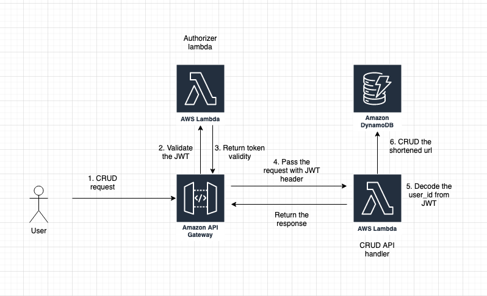
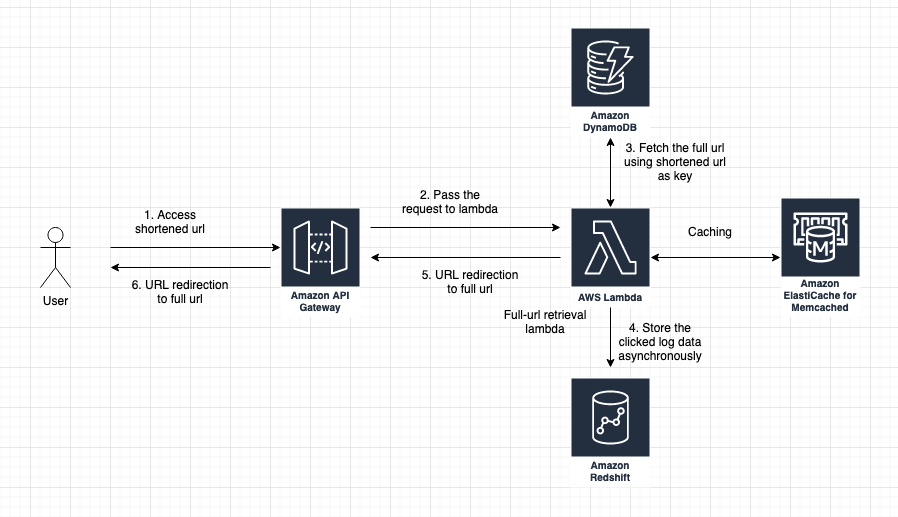

# URL Shortener Project

## Requirements

### Non-Functional Requirements

1. 1,000 daily users, 5-10 short-URL creations per day
2. 100,000 daily visitors, clicking the short URL links

### Functional Requirements

1. API for short URL creation, list, update and delete. No web interface
2. The full URL provided by the customer will always be shortened to an encoded value with our domain. Example: https://www.google.com to https://lin.ks/xCd5a
3. Shortened URLs must be unique for each customer
4. Duplicate shortened links for each customer are not allowed.
   If a customer attempts to create a new shortened link for a URL already existing,
   the existing shortened link will be provided (e.g., a link for https://www.google.com already exists.
   A customer tries to create a new link to the same place, and we return the existing short URL).
5. Reporting function (Total number of clicks, number of clicks by day, Total number of people who clicked links, Total number of people who clicked by day)

## Specs

### Architecture
CRUD API for shortened-url


Full-url redirection using shortened url


### Generating encoded value for each url
The standard way would be using MD5 hashing and base32 like TinyURL.
However, this method has some disadvantages. One is we need to query the DB  to ensure the uniqueness of the key.
The other method uses a short unique ID generator with a tiny collision probability.
This way is simpler and faster than the previous method because we can skip the hashing, encoding, and uniqueness checking.
We use https://shortunique.id/ which can generate a unique ID which shorter than UUID but has a tiny probability of collision.
Let's assume that we use 6 characters key, then use the shortunique.id library we can have 56 billion IDs available.
With 1,000 daily users for 10 short-URL creations per day, we can generate a unique ID for 15 thousand years.

Spec: use shortunique ID library to generate 6 characters unique key for each URL

### Storing the data
We have several data to be stored for this service.
User data, short-url data, and analytic data.
For user data and short-url data, we need a storage that has high availability and is easy to scale.
In this service, we don't need to use relationships between the table, so NoSQL is the better choice.
DynamoDB is one of the NoSQL services by AWS that can be a good choice to store this kind of data.
We use global secondary index for URL table with short_url as the partition_key for fast reading the full-url from table.
For storing the analytic data we can use AWS Redshift because of its scalability and also good at querying big data for analytics.

| Table         | Storing place |
| ------------- | ------------- |
| User          | AWS DynamoDB   |
| URL           | AWS DynamoDB  |
| Analytic Data | AWS Redshift  |

user table schema ( DynamoDB table )
| Attribute | Data type | Primary Key |
| --------- | --------- | ----------- |
| id   | string    | ○　　　　   |

url table schema (DynamoDB table)
| Attribute   | Data type |                   |
| --          | --        | --                |
| user_id     | string    | partition_key     |
| full_url    | string    | sort_key          |
| short_url   | string    | GSI partition_key |
| inserted_at | datetime  |                   |
| updated_at  | datetime  |                   |


clicked_log table schema (Redshift table)
| Attribute          | Data type | required |
| --                 | --        | --       |
| short_url          | string    | ○        |
| clicked_at         | datetime  | ○        |
| visitor_identifier | datetime  | ○        |
| inserted_at        | datetime  | ○        |


### Translating shortened url to fully url
We are going to use the global secondary index from URL table on dynamoDB to find the full_url from short_url.
It can be done by using AWS dynamoDB library to query the table with the short_url match condition.
We can improve the performance by putting a memcached server to cache the query result with short_url as the key.

### API Design

### User authentication for API
The user uses the access_token to access the API.
The access_token is in JWT format that includes the user_id information.
User need to include the access_token to the `Authorization` header for each API request,
so that API Gateway can verify the request using JWT Authorizer lambda.
If the authorizer can validate the JWT then it'll pass the request to API lambda including JWT header. Otherwise, it'll deny the request.
In the API lambda, we can decode the JWT to extract the user_id to CRUD on url data on dynamoDB.
By extracting the user_id information from JWT we can skip querying the user table on dynamoDB which can make our app faster.

The access_token has an expiration date and need to be refreshed using refresh token.

### Reporting function
We record the log everytime a user clicks the shortened-url and store it as a record on Redshift.
We can track the unique user using [fingerprintjs](https://github.com/fingerprintjs/fingerprintjs) and store it as  visitor_identifier in clicked_log table.
From there we can query the aggregation of total number of clicks, number of clicks by day, total number of people who clicked links, and the total number of people who clicked by day.

## Technology stack
- Lambda with nodejs
- Serverless Framework
- API Gateway
- DynamoDB
- AWS Redshift
- Memcached

### Schedule
```
gantt
    title URL-shortener project schedule
    dateFormat  YYYY-MM-DD
    excludes Saturday, Sunday, 2022-07-04, 2022-07-05
    section Section
    Authorizer lambda dev           :a1, 2022-06-23, 1d
    URL-shorterner CRUD lambda dev   :a2, after a1, 4d
    URL retriever lambda dev   :a3, after a2, 2d
    Infra setup                      :a4, after a3, 2d
    Testing, pre-release              :a5, after a4, 2d
```
